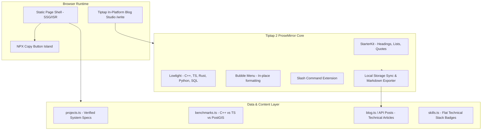
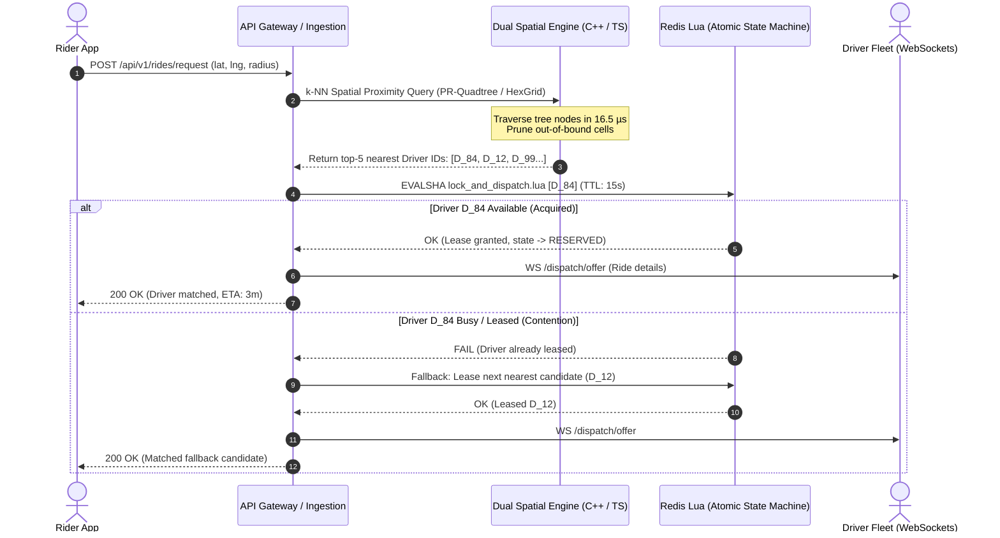

# Technical Architecture Document (ARCHITECTURE.md)
## High-Performance Systems & Distributed Backend Portfolio + Tiptap Authoring Studio

---

### Document Metadata
- **Project**: Systems & Distributed Backend Engineering Portfolio
- **Author**: Soumabrata Ghosh
- **Target Platform**: Next.js 14 (App Router) / React 18 / TypeScript 5 / Tailwind CSS / Tiptap 2
- **Status**: Architecture Specification
- **Version**: 2.1.0

---

## 1. High-Level System Architecture

The application is structured as a hybrid **Server-Rendered Public Portal** with an **Isolated In-Browser Authoring Studio**:
1. **Public Showcase (Zero Overhead)**: Pre-rendered via Next.js Static Site Generation (`SSG`) for instant First Contentful Paint ($le 0.8\text{s}$) with zero layout shifts.
2. **Single Interactive Island (`'use client'`)**: Only the NPX copy-to-clipboard button hydrates on the landing page. Every other public section is server-rendered HTML.
3. **In-Platform Tiptap Authoring Studio (`/write` or `/admin/write`)**: A rich, distraction-free technical editor powered by Tiptap (ProseMirror core), providing slash commands, real-time code highlighting, draft autosave, and Markdown export.



---

## 2. Directory & Module Structure

```
d:/MyWorkspace/Projects/myPortfolio/
├── docs/
│   ├── PRD.md                         # Product Requirements Document
│   ├── ARCHITECTURE.md                # Technical Architecture (this document)
│   └── DESIGN.md                      # Design Tokens, UI/UX System & Wireframes
├── public/
│   ├── images/
│   │   ├── instaride-arch.png         # Pipeline architecture diagram
│   │   └── webhook-relay.png          # DLQ event streaming diagram
│   ├── resume.pdf                     # Direct-download verified resume
│   └── favicon.ico
├── src/
│   ├── app/
│   │   ├── api/
│   │   │   └── posts/route.ts         # Blog post storage & retrieval endpoint
│   │   ├── blog/
│   │   │   ├── [slug]/page.tsx        # High-performance static article reader
│   │   │   └── page.tsx               # All-posts index
│   │   ├── write/
│   │   │   └── page.tsx               # In-Platform Tiptap Authoring Studio (create & edit)
│   │   ├── layout.tsx                 # Root layout with font optimization & theme
│   │   ├── page.tsx                   # Main portfolio landing page
│   │   └── globals.css                # Catppuccin Mocha tokens & grid background
│   ├── components/
│   │   ├── editor/                    # Tiptap In-Platform Blog Studio
│   │   │   ├── BlogEditor.tsx         # Primary Tiptap editor wrapper
│   │   │   ├── EditorBubbleMenu.tsx   # Floating formatting menu on text select
│   │   │   ├── SlashCommandList.tsx   # Notion-like '/' command popup
│   │   │   ├── CodeBlockComponent.tsx # Custom code block with syntax highlight & copy
│   │   │   ├── MetadataBar.tsx        # Title, tags, slug, and status bar
│   │   │   └── EditorPreviewModal.tsx # Side-by-side / overlay full reader preview
│   │   ├── layout/
│   │   │   ├── Navbar.tsx             # Sticky glassmorphism header
│   │   │   └── Footer.tsx             # Verified social links & commit metadata
│   │   ├── sections/
│   │   │   ├── Hero.tsx               # Telemetry Bento Grid + Quick Access panel
│   │   │   ├── FlagshipProject.tsx    # Deep-dive showcase for InstaRide (includes benchmark table)
│   │   │   ├── ProjectGrid.tsx        # Supporting distributed projects
│   │   │   ├── SkillsRow.tsx          # Flat technical stack badges
│   │   │   └── ContactSection.tsx     # Direct links & coordinates
│   │   └── ui/
│   │       ├── BentoCard.tsx          # High-performance glassmorphism card
│   │       ├── Sparkline.tsx          # SVG hardware-accelerated throughput sparkline
│   │       ├── CopyButton.tsx         # One-click clipboard helper with toast
│   │       └── Badge.tsx              # Status indicator pills (Production, Optimal, etc.)
│   ├── data/
│   │   ├── projects.ts                # Project metadata, metrics, and architecture points
│   │   ├── benchmarks.ts              # Concrete performance benchmark data
│   │   ├── skills.ts                  # Flat technical stack badges
│   │   └── socialLinks.ts             # Coordinates, NPX command, resume path
│   ├── lib/
│   │   ├── blog.ts                    # Post parser & local storage sync
│   │   ├── tiptap-lowlight.ts         # Lowlight syntax highlighting configuration
│   │   └── utils.ts                   # Classnames joiner & formatting helpers
│   └── types/
│       ├── portfolio.ts               # Project, benchmark, and skill models
│       └── blog.ts                    # Article, draft, and editor schema
```

---

## 3. In-Platform Blog Studio Architecture (Tiptap 2)

### 3.1 Tiptap Extension Pipeline
The editor is constructed with a modular pipeline of Tiptap 2 headless extensions:

```typescript
// src/lib/tiptap-extensions.ts
import StarterKit from '@tiptap/starter-kit';
import CodeBlockLowlight from '@tiptap/extension-code-block-lowlight';
import Placeholder from '@tiptap/extension-placeholder';
import BubbleMenu from '@tiptap/extension-bubble-menu';
import Table from '@tiptap/extension-table';
import TableRow from '@tiptap/extension-table-row';
import TableCell from '@tiptap/extension-table-cell';
import TableHeader from '@tiptap/extension-table-header';
import Link from '@tiptap/extension-link';
import { common, createLowlight } from 'lowlight';
import cpp from 'highlight.js/lib/languages/cpp';
import rust from 'highlight.js/lib/languages/rust';
import typescript from 'highlight.js/lib/languages/typescript';
import python from 'highlight.js/lib/languages/python';
import sql from 'highlight.js/lib/languages/sql';

const lowlight = createLowlight(common);
lowlight.register('cpp', cpp);
lowlight.register('rust', rust);
lowlight.register('typescript', typescript);
lowlight.register('python', python);
lowlight.register('sql', sql);

export const getEditorExtensions = () => [
  StarterKit.configure({
    codeBlock: false, // Replaced by CodeBlockLowlight
    heading: { levels: [1, 2, 3] },
  }),
  CodeBlockLowlight.configure({ lowlight }),
  Placeholder.configure({ placeholder: "Type '/' for commands or start typing your post-mortem..." }),
  Table.configure({ resizable: true }),
  TableRow,
  TableHeader,
  TableCell,
  Link.configure({ openOnClick: false }),
];
```

### 3.2 Notion-Style Slash (`/`) Command Architecture
The slash command system is triggered when the user types `/` on an empty line:
- **Trigger**: Intercepted by a custom Tiptap Suggestion plugin (`tiptap-extension-slash`).
- **Command Registry**:
  - `Header 1 / 2 / 3`: Injects standard Markdown headings.
  - `Code Block`: Injects lowlight-syntax block with default language `typescript` or `cpp`.
  - `Benchmark Table`: Injects a pre-formatted 3-column comparative table.
  - `Architecture Callout`: Injects a custom styled alert node (`[!NOTE]` or `[!IMPORTANT]`).
  - `Divider`: Injects `<hr />`.

### 3.3 Draft Persistence & Export Engine
1. **Debounced LocalStorage Autosave**:
   Every keystroke updates local draft state using a 500ms debounce. If the user accidentally closes the tab or refreshes, work is restored with zero data loss.
2. **Export to Clean Markdown / MDX**:
   Converts Tiptap JSON document structure to clean Markdown format (`frontmatter + content`) with a single click.
3. **Publish Endpoint**:
   Sends the post payload (`{ title, slug, excerpt, tags, htmlContent, jsonContent }`) to `/api/posts` for storage.

---

## 4. Flagship System Architecture: InstaRide



### 4.1 Dual Spatial Core Architecture
1. **Low-Level Native C++ Core (`cpp-engine/`)**:
   - Memory layout: Struct-of-Arrays (SoA) packed spatial point coordinates (`double x, y; uint32_t id;`).
   - PR-Quadtree with adaptive depth bounding (maximum depth 16) and bounding-box pruning.
   - Measured throughput: **3.88M point updates/sec** under sustained multithreaded load.
2. **TypeScript / Node.js Distributed Orchestrator (`src/`)**:
   - Real-time WebSocket connection manager handling concurrent driver location heartbeats.
   - Redis Geospatial fallback and Concentric Ring HexGrid queries for macro-level geo-fencing.

### 4.2 Atomic Redis Lua Dispatch Engine
- Atomic single-lease execution within Redis:
  ```lua
  local current_state = redis.call('GET', KEYS[1])
  if current_state == 'AVAILABLE' or not current_state then
      redis.call('SET', KEYS[1], 'RESERVED', 'EX', ARGV[2])
      redis.call('HSET', 'ride:' .. ARGV[1], 'assigned_driver', KEYS[1])
      return 1
  else
      return 0
  end
  ```
- **Guaranteed Invariant**: Zero double-dispatch across $> 10,000$ concurrent synthetic requests.

---

## 5. Type System & Data Models

```typescript
// src/types/blog.ts
export interface BlogPost {
  slug: string;
  title: string;
  excerpt: string;
  date: string;
  readingTime: string;
  tags: string[];
  author: string;
  featured: boolean;
  content: string; // Markdown or HTML string
  jsonContent?: Record<string, unknown>; // Tiptap JSON format
}

export interface PostDraft {
  id: string;
  title: string;
  slug: string;
  tags: string[];
  excerpt: string;
  content: string;
  updatedAt: string;
}

// src/types/portfolio.ts
export interface Project {
  id: string;
  title: string;
  tagline: string;
  description: string;
  role: string;
  year: string;
  status: 'production' | 'completed' | 'benchmark';
  category: 'distributed' | 'systems' | 'fullstack';
  technologies: string[];
  githubUrl: string;
  liveUrl?: string;
  heroImage: string;
  metrics: string;
  highlights: string[];
  chaosResilience?: string[];
}
```

---

## 6. Build, Deployment, & Dependencies

### 6.1 Package Dependencies to Install
```json
{
  "dependencies": {
    "@tiptap/react": "^2.11.5",
    "@tiptap/starter-kit": "^2.11.5",
    "@tiptap/extension-code-block-lowlight": "^2.11.5",
    "@tiptap/extension-placeholder": "^2.11.5",
    "@tiptap/extension-bubble-menu": "^2.11.5",
    "@tiptap/extension-table": "^2.11.5",
    "@tiptap/extension-table-row": "^2.11.5",
    "@tiptap/extension-table-cell": "^2.11.5",
    "@tiptap/extension-table-header": "^2.11.5",
    "@tiptap/extension-link": "^2.11.5",
    "lowlight": "^3.3.0",
    "highlight.js": "^11.11.1",
    "lucide-react": "^0.475.0",
    "clsx": "^2.1.1"
  }
}
```

### 6.2 Performance Guardrails
- **Editor Route Code Splitting**: The Tiptap editor is dynamically loaded (`dynamic(() => import('@/components/editor/BlogEditor'), { ssr: false })`) to ensure that the primary portfolio landing page (`/`) downloads zero editor JavaScript!
- **Zero Third-Party Tracking**: The editor operates completely client-side in the browser with local autosave.
