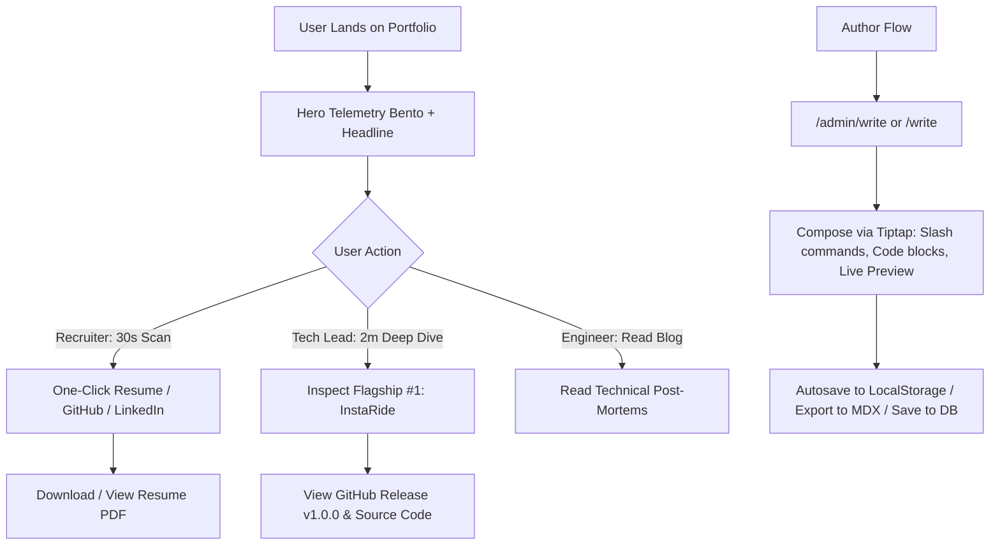

# Product Requirements Document (PRD)
## Next-Gen Systems & Distributed Backend Portfolio + Tiptap Authoring Studio

---

### Document Metadata
- **Project**: High-Performance Systems & Distributed Backend Portfolio
- **Author**: Soumabrata Ghosh
- **Target Audience**: Staff/Principal Engineers, Engineering Directors, Distributed Systems Tech Leads, High-Growth Backend Recruiters
- **Status**: Ready for Implementation
- **Version**: 2.1.0

---

## 1. Executive Summary & Value Proposition

### 1.1 The Problem with Standard Developer Portfolios
Most developer portfolios fail to communicate true backend and distributed systems competence:
- They display subjective skill meters (e.g., "Python 90%").
- They show toy metrics (e.g., "Portfolio views: 3", arbitrary "p95: 45ms (cached)").
- They present frontend-heavy clones that fail to demonstrate concurrency, data consistency, caching strategies, spatial partitioning, or resilience under load.
- Their blogs are hosted on third-party platforms (Medium, Hashnode) with intrusive ads, paywalls, and no native connection to the developer's brand.

### 1.2 The Core Value Proposition
This redesigned portfolio positions **Soumabrata Ghosh** as an **undeniable Systems, Distributed Backend, and Concurrency Engineer**, featuring:
1. **Show, Don't Tell**: Real, hardware-verified benchmark numbers (3.88M ops/sec, 16.5 µs $k$-NN, 71.9k locks/sec) backed by reproducible GitHub repositories.
2. **InstaRide as Flagship #1**: Pinned front-and-center, highlighting the C++ / TypeScript dual spatial core, Redis Lua distributed atomic state machine, and adversarial chaos testing.
3. **Zero-Friction Access**: One-click resume, GitHub, and LinkedIn alongside a copyable `npx soumabrata` card — no CLI or typing required to reach the evidence.
4. **Native In-Platform Blog Studio (Tiptap-Powered)**: A self-hosted, in-browser authoring environment allowing the developer to write, format, preview, and publish technical case studies directly inside their portfolio using a Notion-style Tiptap editor.

---

## 2. Target Personas & User Journeys

### 2.1 Personas

| Persona | Primary Goal | Time Spent | Key Trigger / Buying Signal |
| :--- | :--- | :--- | :--- |
| **Technical Recruiter** (Stripe, Uber, Datadog) | Validate keywords, experience tier, and project legitimacy | 30–60 seconds | Clean headline, verified GitHub links, instant PDF resume. |
| **Hiring Manager / Tech Lead** | Assess systems architecture, production readiness, and code quality | 2–5 minutes | Architecture flowcharts, benchmark tables, concurrency mechanics, chaos resilience. |
| **Staff / Principal Systems Engineer** | Evaluate algorithmic depth, low-level efficiency, and trade-off maturity | 5–10 minutes | Memory layout, C++ quadtree pointer optimizations, Redis Lua atomicity, edge failure handling. |
| **Author (Soumabrata)** | Draft, refine, and publish technical deep dives & post-mortems | Authoring Sessions | Distraction-free Tiptap editor, slash commands, syntax-highlighted code blocks, one-click export/publish. |

### 2.2 Critical User Journeys



---

## 3. Feature Specifications & Requirements

### Feature 1: Telemetry Hero Bento Grid
- **Card 1: Spatial Ingestion Throughput**: `3.88M ops/sec` (*C++ Spatial Engine | Memory Packed Points*). Includes visual sparkline showing throughput under load.
- **Card 2: Top-5 $k$-NN Proximity Latency**: `16.5 µs` (*In-memory PR-Quadtree | Cache-friendly bounds*).
- **Card 3: Atomic Lock Rate (Zero Race Conditions)**: `71.9k /sec` (*Redis Lua Scripting | Single-lease dispatch*).
- **Card 4: Adversarial Chaos Resilience**: `50k Points / 0 Crashes` (*Singularity attack, coordinate poisoning survived*).
- **NPX Business Card Bar**: One-click copy for `$ npx soumabrata` with live copied feedback toast.
- **Quick Action Bar**: Resume PDF direct download/view button, GitHub profile, LinkedIn.

### Feature 2: Quick Access Panel
- **Action Buttons**: `View Resume PDF` (direct download), `GitHub Profile`, `LinkedIn` — plain anchor links, no JavaScript, no modal.
- **NPX Card**: Copyable `$ npx soumabrata` one-liner with a single client-side copy button and transient confirmation toast.
- **Rationale**: A visitor must reach the resume or the source code in one click. Every entry point here is a real link to real evidence; nothing on this panel is a simulated interface.

### Feature 3: Flagship Project Showcase — InstaRide
- **Header Badges**: `Production v1.0.0`, `Dual Spatial Core (C++ / TS)`, `Zero Double-Dispatch Verified`.
- **Four-Part Structure**:
  1. **Problem Statement**: Sub-millisecond driver lookup across 100,000 concurrent GPS pings with zero double-dispatch race conditions.
  2. **Architecture Diagram**: Interactive flowchart comparing Ingestion Pipeline $\rightarrow$ Spatial Core $\rightarrow$ Redis Lua Atomic Dispatch Engine $\rightarrow$ WebSocket Broadcast.
  3. **Benchmark Metrics Table**:
     - Ingestion: `3,880,000 ops/sec` (C++) vs `68,000 ops/sec` (Naive scan).
     - $k$-NN Search: `16.5 µs` (PR-Quadtree) vs `1,250 µs` (Naive scan).
     - Lock Acquisition: `0.014 ms` (Atomic Redis Lua).
     - Double-Dispatch Error Rate: `0.000%` across 10,000 concurrent rider leases.
  4. **Chaos Engineering & Resilience**: Singularity collapse, coordinate poisoning, boundary thrashing, lock starvation.

### Feature 4: Native In-Platform Blog Studio (Tiptap Integration)
- **Objective**: Provide an in-browser Notion-style technical authoring suite on your own domain (`/write` or `/admin/write`).
- **Core Tiptap Capabilities**:
  1. **Notion-Style Slash Commands (`/`)**:
     - `/h1`, `/h2`, `/h3`: Headings with anchor IDs.
     - `/code`: Syntax-highlighted code block with language dropdown selector (C++, Rust, TypeScript, Python, SQL, Go, JSON, Bash).
     - `/callout`: Highlight box with alert types (`Note`, `Tip`, `Important`, `Warning`).
     - `/table`: Interactive row/column data tables for benchmark comparisons.
     - `/quote`: Blockquote for architectural design principles.
     - `/divider`: Thematic break line.
  2. **Floating Bubble Menu**:
     - Pops up on text selection with formatting options: **Bold**, *Italic*, `Inline Code`, Strikethrough, Hyperlink.
  3. **Markdown Shortcuts (Typing Speed)**:
     - Typing `# ` automatically converts to Heading 1.
     - Typing ```ts ``` creates a TypeScript code block.
     - Typing `> ` creates a blockquote.
     - Typing `- ` creates an unordered list.
  4. **Code Syntax Highlighting (Lowlight / Highlight.js)**:
     - Real-time syntax coloring using `@tiptap/extension-code-block-lowlight` styled with the Catppuccin Mocha theme.
     - Copy button on all code snippets.
  5. **Article Metadata Panel**:
     - Sidebar or top bar for: Title, URL Slug, Summary/Excerpt, Tags, Estimated Read Time, and Featured toggle.
  6. **Persistence & Export Modes**:
     - **Autosave**: Continuous debounced autosave to browser `localStorage` (prevents work loss on reload).
     - **Export to Markdown/MDX**: One-click download of the active article as a formatted `.mdx` file.
     - **Publish**: Direct JSON/HTML dispatch to Next.js API route (`/api/posts`) for database persistence or local storage.

### Feature 5: Public Engineering Blog
- **Index Page (`/blog`)**: All published posts as a reverse-chronological list — title, date, excerpt, tags, and estimated read time. One click to any post; no pagination, no filters.
- **Reader (`/blog/[slug]`)**: Clean, typography-optimized reader using `@tailwindcss/typography` (`prose prose-invert`). Estimated read time, publication date, author badge, and tag badges. Reading progress bar pinned to the top of the viewport. One-click copy on every code block.
- **Edit Path**: Every reader page exposes an `Edit` action that loads the post into `/write` pre-populated with its existing content, slug, and metadata.

---

## 4. Non-Functional Requirements (NFRs)

| Metric | Target | Measurement Strategy |
| :--- | :--- | :--- |
| **Lighthouse Performance** | $\ge 98$ | Static generation (`SSG`) for reader pages, minimal initial JS bundle. |
| **First Contentful Paint (FCP)** | $\le 0.8\text{s}$ | Critical CSS inlined, server-rendered HTML shell. |
| **Cumulative Layout Shift (CLS)** | $0.00$ | Reserved heights for code blocks and benchmark tables; no layout-shifting interactive islands. |
| **Editor Keystroke Latency** | $< 16\text{ms}$ (60 FPS) | Tiptap headless ProseMirror transactions without unnecessary React re-renders. |
| **Mobile Responsiveness** | $100\%$ | Fluid scaling from 320px (mobile) to 4K Ultrawide screens. |

---

## 5. Success Metrics & KPIs
1. **Authoring Velocity**: Ability to write and export/publish a technical post-mortem in $< 30$ minutes without external dependencies.
2. **Zero Vanity Metrics**: Complete removal of toy metrics (`Views: 3`, arbitrary latency claims).
3. **Recruiter & Lead Conversion**: Increased engagement with architecture diagrams and technical deep dives.
